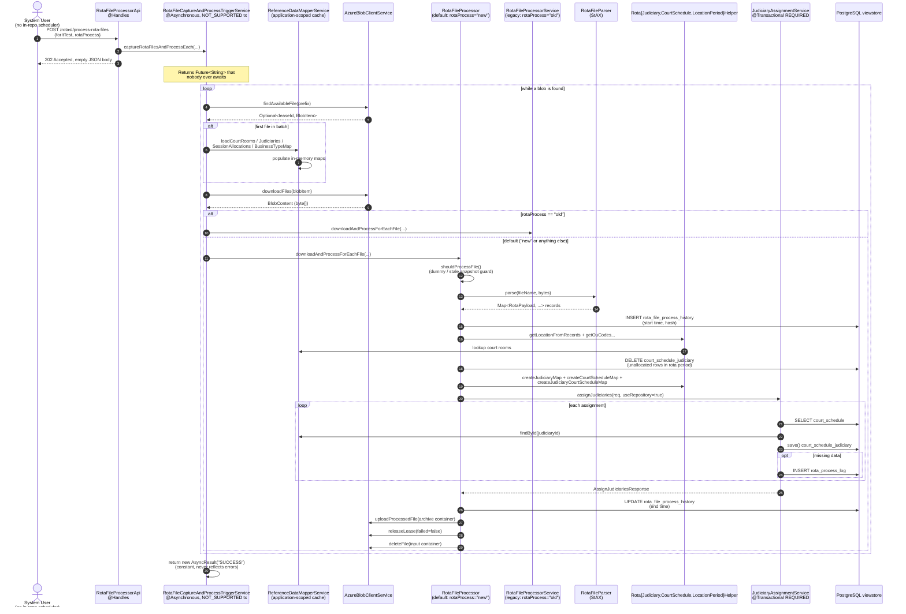

# `process_rota_files` — step-by-step flow

This document traces what happens when a caller posts to `POST /rotasl/process-rota-files` with
media type `application/vnd.courtscheduler.rotasl.process_rota_files+json`. It is intended for
engineers reasoning about correctness, performance, and refactor decisions on this path.

For the broader rota system (file types, snapshot rules, OU code mapping concepts), see
`TECHNICAL_DOCUMENTATION.md` § "Rota File Processing".

---

## 1. Endpoint contract

| Aspect                    | Value                                                                                                                    |
|---------------------------|--------------------------------------------------------------------------------------------------------------------------|
| Path                      | `POST /rotasl/process-rota-files`                                                                                        |
| Request media type        | `application/vnd.courtscheduler.rotasl.process_rota_files+json`                                                          |
| Command name (`@Handles`) | `courtscheduler.rotasl.process_rota_files`                                                                               |
| RAML                      | `listingcourtscheduler-api/src/raml/courtscheduler-api.raml` (lines 543–558)                                             |
| Request schema            | `listingcourtscheduler-api/src/raml/json/schema/courtscheduler.rotasl.process_rota_files.json`                           |
| Request example           | `listingcourtscheduler-api/src/raml/json/courtscheduler.rotasl.process_rota_files.json`                                  |
| Response                  | `202 Accepted`, body is `{}`                                                                                             |
| Access control            | DRL rule `"API - Action - courtscheduler.rotasl.process_rota_files"` — only `userAndGroupProvider.isSystemUser($action)` |

### Request payload

```json
{
  "forItTest": false,
  "rotaProcess": "new"
}
```

| Field         | Type    | Default | Effect                                                                                                                                           |
|---------------|---------|---------|--------------------------------------------------------------------------------------------------------------------------------------------------|
| `forItTest`   | boolean | `false` | When `true`, scans blobs with prefix `IT_Test_` instead of the production `lja_` prefix.                                                         |
| `rotaProcess` | string  | `"new"` | `"old"` routes to the legacy `RotaFileProcessorService`; **anything else** (including unknown values) routes to the current `RotaFileProcessor`. |

---

## 2. Sequence diagram



---

## 3. Step-by-step narrative

All references are relative to the repository root.

| #  | Step                     | Location                                                                                                                                                               | What it does                                                                                                                                                                                                      |
|----|--------------------------|------------------------------------------------------------------------------------------------------------------------------------------------------------------------|-------------------------------------------------------------------------------------------------------------------------------------------------------------------------------------------------------------------|
| 1  | Handle command           | `listingcourtscheduler-api/src/main/java/uk/gov/moj/cpp/courtscheduler/api/RotaFileProcessorApi.java:38–51`                                                            | Parses `forItTest` (default `false`) and `rotaProcess` (default `"new"`); calls the trigger service; returns `202` with an empty JSON object.                                                                     |
| 2  | Spawn async batch        | `…/api/service/rota/RotaFileCaptureAndProcessTriggerService.java:45–91`                                                                                                | `@Asynchronous` + `TransactionAttributeType.NOT_SUPPORTED`. Whole batch runs on an EJB worker thread and outside any transaction.                                                                                 |
| 3  | Pick blob prefix         | `RotaFileCaptureAndProcessTriggerService.java:49`                                                                                                                      | `IT_Test_` if `forItTest=true`, else `lja_`.                                                                                                                                                                      |
| 4  | Loop until empty         | `:54–87`                                                                                                                                                               | `do { findAvailableFile → process } while (fileAvailable)`.                                                                                                                                                       |
| 5  | Lease + find             | `:57` (delegates to `AzureBlobClientService.findAvailableFile`)                                                                                                        | Acquires an indefinite blob lease (`-1` duration) on the first unleased blob matching the prefix. The lease is the concurrency guard.                                                                             |
| 6  | Lazy reference-data load | `:66–69` + `:93–103`                                                                                                                                                   | Calls `loadCourtRooms`, `loadJudiciaries`, `loadCourtRoomSessionAllocations`, `loadBusinessTypeMap` on `ReferenceDataMapperService`. Done **once per batch**, only after the first file is found.                 |
| 7  | Download                 | `:72`                                                                                                                                                                  | Pulls bytes from the input container (`schedulelistinginput`) into a `BlobContent` (`byte[]`).                                                                                                                    |
| 8  | Route by mode            | `:76–82`                                                                                                                                                               | `"old"` → legacy `RotaFileProcessorService`; otherwise → `RotaFileProcessor`.                                                                                                                                     |
| 9  | Skip-or-process gate     | `…/api/service/rota/RotaFileProcessor.java:149–161` (`shouldProcessFile`)                                                                                              | Returns `false` for dummy support files and for snapshot files whose newer version has already been processed. **Note:** runs *after* the download in step 7.                                                     |
| 10 | Parse + history INSERT   | `RotaFileProcessor.java:258–265` (`parseFileContent`) and `:267–277` (`parseFile`)                                                                                     | Creates a `RotaFileProcessHistory` row (execution UUID, MD5 hash, file name, start time) via `RotaFileProcessHistoryService`, then StAX-parses the XML into `Map<RotaPayload, Map<String, Map<String, String>>>`. |
| 11 | Resolve OU codes         | `:114–117` via `RotaLocationPeriodHelper`                                                                                                                              | Extracts location IDs from the parsed records, then maps each to its OU code via the cached court-room data.                                                                                                      |
| 12 | Delete pre-existing      | `:120–125` (`deleteUnAllocatedCourtScheduleJudiciariesForRotaPeriod`)                                                                                                  | Destructive DELETE on `court_schedule_judiciary` for the rota period and OU codes — happens **before** the new rows are written.                                                                                  |
| 13 | Build three maps         | `:174–193` (`createProcessingMaps`)                                                                                                                                    | (a) `justiceId → judiciary UUID`; (b) `listingProfileId → Set<court schedule UUID>`; (c) `judiciaryId → List<JudiciaryCourtScheduleData>` (carries `position`, `isBenchChairman`, `isDeputy`).                    |
| 14 | Flatten → assignments    | `:206–228` (`executeJudiciaryAssignments`)                                                                                                                             | Streams the third map into `List<JudiciaryScheduleAssignment>`, filtering empty entries.                                                                                                                          |
| 15 | Persist assignments      | `JudiciaryAssignmentService.assignJudiciaries(req, requester, executionId, true)` in `listingcourtscheduler-common/.../service/JudiciaryAssignmentService.java:74–104` | Per assignment: `SELECT court_schedule`, look up judiciary in the cache, then `courtScheduleJudiciaryRepository.save(entity)`. Missing judiciary/session IDs land in `rota_process_log`.                          |
| 16 | History UPDATE           | `RotaFileProcessor.java:136`                                                                                                                                           | Sets `process_end_date` on the row written in step 10. **Not updated on the failure path** (see step 18).                                                                                                         |
| 17 | Archive + cleanup        | `:231–244` (`uploadAndCleanup`)                                                                                                                                        | Upload bytes to `schedulelistingoutput`, release lease (`failed=false`), delete the original from the input container.                                                                                            |
| 18 | Failure path             | `:81–84`                                                                                                                                                               | On any `RuntimeException`: log, release lease with `failed=true` (creates a `_failed` marker copy in the input container). The outer loop continues with the next file.                                           |
| 19 | Loop terminates          | `RotaFileCaptureAndProcessTriggerService.java:87–91`                                                                                                                   | When `findAvailableFile` returns empty, returns `new AsyncResult<>("SUCCESS")`. The string is a constant; nothing awaits the `Future`.                                                                            |

### Persistence side effects

| Table                       | Operation                 | Trigger                                                         |
|-----------------------------|---------------------------|-----------------------------------------------------------------|
| `rota_file_process_history` | INSERT then UPDATE        | Step 10 (start), step 16 (end). Never updated on failure.       |
| `court_schedule_judiciary`  | DELETE then INSERT/UPDATE | Step 12 (delete), step 15 (write).                              |
| `rota_process_log`          | INSERT (conditional)      | Step 15, when missing judiciary or session IDs are encountered. |

### Blob side effects

| Container               | Operation                 | Trigger                    |
|-------------------------|---------------------------|----------------------------|
| `schedulelistinginput`  | LEASE → DOWNLOAD → DELETE | Steps 5, 7, 17 on success. |
| `schedulelistinginput`  | COPY to `<name>_failed`   | Step 18 on failure.        |
| `schedulelistingoutput` | UPLOAD                    | Step 17 on success.        |

---

## 4. Improvement / question candidates

These are **observations**, not recommended changes — the user wants to interrogate specific
decisions before any refactor. Each item points to the line so the conversation stays anchored to
the code.

1. **Two parallel processors selected by request payload** —
   `RotaFileCaptureAndProcessTriggerService.java:76–82`. `rotaProcess="old"` routes to the legacy
   `RotaFileProcessorService`; the entire `listingcourtscheduler-rota-file-processor` module (
   `RotaDataEnricher`, `JudiciaryScheduleEnricher`, `RotaFilePartialProcessor`) exists only to
   support that path. Looks like a strangler-fig leftover.
2. **`forItTest` is a payload flag, not config** — `RotaFileProcessorApi.java:43`. Any caller can
   flip the blob prefix to `IT_Test_`. Test-only switching is exposed through the public schema and
   the DRL doesn't filter it.
3. **Async result is decorative** — `RotaFileCaptureAndProcessTriggerService.java:90`. Returns
   `new AsyncResult<>("SUCCESS")` as a constant; nothing awaits the `Future`, and failures never
   reach it.
4. **No correlation id returned to the caller** — `RotaFileProcessorApi.java:50`. `202` carries
   `{}`. Combined with #5, callers cannot tell when processing finished or whether it succeeded.
5. **No domain event emitted on completion** — verified via search of `listingcourtscheduler-domain`
   and any `event-processor` module: no `RotaFileProcessed`-style events exist. Other contexts
   cannot react without polling.
6. **`shouldProcessFile` runs after download** — `RotaFileProcessor.java:99` is called *inside*
   `processBlob`, which is itself invoked *after* `downloadFiles` at
   `RotaFileCaptureAndProcessTriggerService.java:72`. Dummy and stale-snapshot files pay the full
   download cost.
7. **History row is half-written on failure** — `RotaFileProcessor.java:259` writes
   `RotaFileProcessHistory` with the start time; the catch at `:81–84` does not touch the end time.
   Failed runs are indistinguishable from in-flight runs in the table.
8. **Destructive delete before insert** — `RotaFileProcessor.java:121–125`. Unallocated assignments
   for the period are deleted before the new ones are written. If `assignJudiciaries` throws
   afterwards, the period is left under-populated until the file is reprocessed.
9. **`AzureBlobClientException` swallowed with hard-coded message** —
   `RotaFileCaptureAndProcessTriggerService.java:83–85`. Logs `"already leased and skipping"`
   regardless of the actual cause and discards the original exception detail.
10. **Strict serial single-thread loop** — `:54–87`. Files are processed one at a time on a single
    async EJB thread even though per-file work has no shared state besides the reference-data
    caches.
11. **Reference data freshness unbounded** — `:66–69`. Loaded once per batch into application-scoped
    maps. A long-running batch (or fast-following batches) can use stale data; there is no TTL or
    invalidation.
12. **Magic strings for processor selection** — `RotaFileCaptureAndProcessTriggerService.java:29` (
    `ROTA_PROCESS_OLD = "old"`) and `RotaFileProcessorApi.java:23` (`ROTA_PROCESS_NEW = "new"`).
    Anything other than `"old"` silently routes to `"new"` — no validation.
13. **DRL allows only `SYSTEM_USER` but no in-repo scheduler exists** —
    `listingcourtscheduler-api/src/main/resources/uk.gov.moj.cpp.courtscheduler.api.accesscontrol.drl/courtscheduler-api.drl`
    rule `"API - Action - courtscheduler.rotasl.process_rota_files"` requires
    `userAndGroupProvider.isSystemUser`. The expected caller (cron job, external scheduler) is not
    in this repo.
14. **`useRepository=true` boolean parameter** — `RotaFileProcessor.java:301` and
    `JudiciaryAssignmentService.java:74–104`. The same service has two persistence modes (
    `repository.save()` vs `entityManager.merge()`) chosen by a boolean — classic flag-argument
    smell.
15. **Comment-heavy private methods restate signatures** — `RotaFileProcessor.java:91–97`,
    `:163–173`, `:195–205`, `:250–257`, `:283–294`. The Javadoc largely restates parameter names;
    per the workspace `CLAUDE.md` "default to writing no comments" guidance these are noise.

---

## 5. Critical files

-
`listingcourtscheduler-api/src/main/java/uk/gov/moj/cpp/courtscheduler/api/RotaFileProcessorApi.java`
-
`listingcourtscheduler-api/src/main/java/uk/gov/moj/cpp/courtscheduler/api/service/rota/RotaFileCaptureAndProcessTriggerService.java`
-
`listingcourtscheduler-api/src/main/java/uk/gov/moj/cpp/courtscheduler/api/service/rota/RotaFileProcessor.java`
-
`listingcourtscheduler-common/src/main/java/uk/gov/moj/cpp/courtscheduler/common/service/JudiciaryAssignmentService.java`
-
`listingcourtscheduler-common/src/main/java/uk/gov/moj/cpp/courtscheduler/common/AzureBlobClientService.java`
-
`listingcourtscheduler-rota-file-processor/src/main/java/uk/gov/moj/cpp/courtscheduler/rotafileprocessor/RotaFileProcessorService.java` (
legacy path)
-
`listingcourtscheduler-api/src/main/resources/uk.gov.moj.cpp.courtscheduler.api.accesscontrol.drl/courtscheduler-api.drl`
- `TECHNICAL_DOCUMENTATION.md` lines 471–590 (existing rota section, written for the legacy path)
